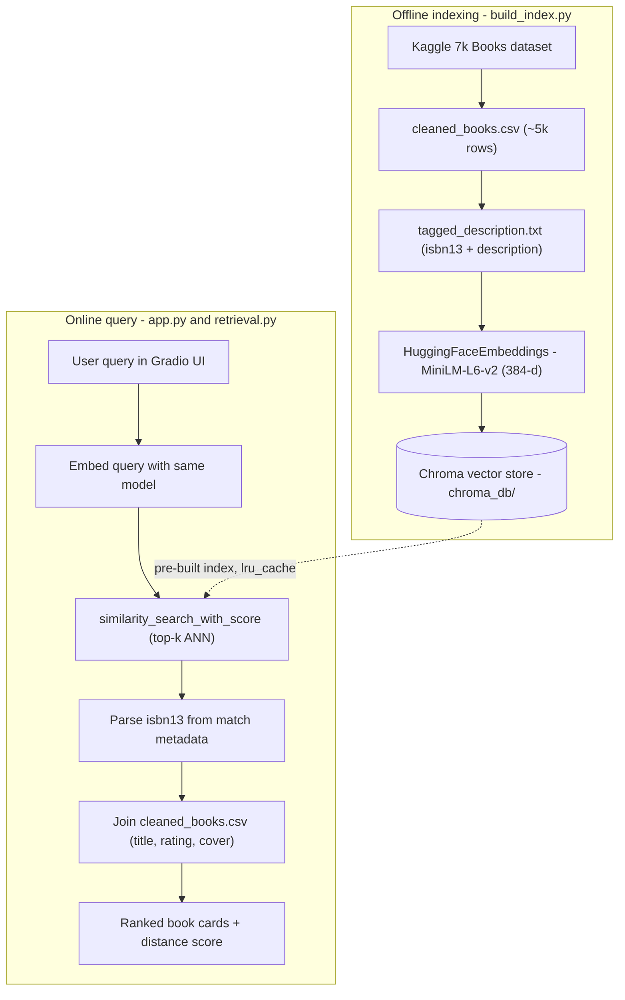

# LLM Book Recommender

Semantic book search over ~7,000 titles — describe what you want in plain English and get ranked recommendations.

**Live demo → [huggingface.co/spaces/tamilbharathiaishitter/llm-book-recommender](https://huggingface.co/spaces/tamilbharathiaishitter/llm-book-recommender)**

## Demo


*Loops automatically (1080p WebP) — semantic search over motivation, mystery, and fantasy queries. [Full HD MP4 →](https://github.com/tamil-code/llm-book-recommender/releases/download/demo/LLM.Book.Recommender.mp4)*

## How it works

- Book descriptions are embedded with `all-MiniLM-L6-v2` and indexed in Chroma.
- A natural-language query runs similarity search; results map back to catalog rows via ISBN.
- A Gradio app serves the live demo on Hugging Face Spaces.



**Architecture notes (interview-ready):**
- **Retrieval type:** dense semantic search — meaning-based, not keyword/BM25.
- **Join key:** `isbn13` links vector documents back to structured catalog rows (no LLM generation at query time).
- **Cold start:** index is pre-built and committed; the Space skips re-embedding ~5k books on every deploy.
- **Trade-off:** fast CPU inference with a small bi-encoder; no cross-encoder re-ranking.

## Quick start

```bash
git clone https://github.com/tamil-code/llm-book-recommender.git
cd llm-book-recommender
python3 -m venv venv && source venv/bin/activate
pip install -r requirements-app.txt
python app.py
```

Open http://127.0.0.1:7860 and try a query like *"cozy mystery set in a small town"*.

**Tech stack:** Gradio, LangChain, Chroma, sentence-transformers, pandas.
